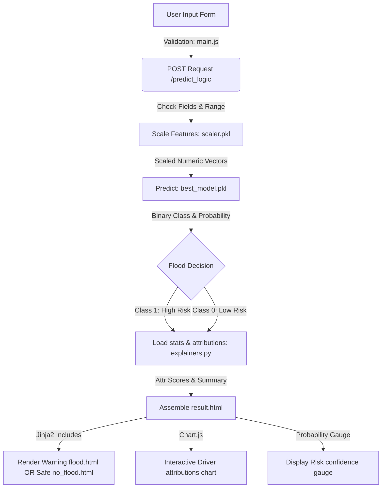

# Rising Waters: A Machine Learning Approach to Flood Prediction

Rising Waters is a web-based, production-ready flood prediction system that utilizes meteorological and precipitation statistics to evaluate local flood risk hazards. It is engineered with a Random Forest classifier at its core, wrapped in a Flask web application, and styled using a premium, dark-mode glassmorphism interface.

---

## 🏗️ Project Architecture

The system is organized as a modular, clean Python application:

```
FloodPrediction/
│
├── app.py                      # Flask Application with validation & prediction logic
├── requirements.txt            # Python Dependencies (pinned)
├── runtime.txt                 # Python runtime for IBM Cloud (3.10.11)
├── Procfile                    # Web process runner configuration for production
├── README.md                   # Comprehensive project documentation
│
├── models/
│   ├── best_model.pkl          # Saved trained Random Forest model (joblib)
│   ├── scaler.pkl              # Saved StandardScaler object (joblib)
│   ├── feature_columns.pkl     # Saved list of features (joblib)
│   └── feature_stats.json      # Precalculated feature medians for attributions (JSON)
│
├── static/
│   ├── css/
│   │   └── style.css           # Premium Glassmorphism theme, styling & animations
│   ├── js/
│   │   └── main.js             # Form validation & interactive Chart.js graphs
│   └── images/
│       └── *                   # Saved static EDA plots for the dashboard
│
├── templates/
│   ├── layout.html             # Common layout template (navbar, footer, imports)
│   ├── home.html               # Main dashboard with EDA stats & plots
│   ├── predict.html            # Meteorological input form with tooltips
│   ├── result.html             # High-fidelity result card (gauge & drivers breakdown)
│   ├── flood.html              # Warning partial template (High Risk recommendations)
│   └── no_flood.html           # Safety partial template (Low Risk recommendations)
│
├── notebooks/
│   └── eda_and_modeling.ipynb  # Interactive Jupyter Notebook for submission
│
└── utils/
    └── explainers.py           # Feature contribution explainer for predictions
```

---

## 🔄 Workflow Diagram

The flowchart below shows how weather readings flow from the user interface, through the preprocessors, to the ML models, and back to the explanation engine:



---

## 📊 Dataset Description

The models are trained using a historical weather observation dataset containing the following features:

| Column Name | Feature Type | Description | Datatype | Range / Distribution |
| :--- | :--- | :--- | :--- | :--- |
| **Temp** | Numerical (Discrete) | Average local temperature | `int64` | 28°C to 31°C |
| **Humidity** | Numerical (Discrete) | Relative air humidity percentage | `int64` | 70% to 79% |
| **Cloud Cover** | Numerical (Discrete) | Density of regional cloud coverage | `int64` | 30% to 44% |
| **Jan-Feb** | Numerical (Continuous) | Total winter rainfall (mm) | `float64` | 0.0 to 98.1 mm |
| **Mar-May** | Numerical (Continuous) | Total spring rainfall (mm) | `float64` | 28.4 to 915.2 mm |
| **Jun-Sep** | Numerical (Continuous) | Monsoon season rainfall (mm) *[Key Predictor]* | `float64` | 1057.8 to 3451.3 mm |
| **Oct-Dec** | Numerical (Continuous) | Total post-monsoon rainfall (mm) | `float64` | 141.8 to 823.3 mm |
| **ANNUAL** | Numerical (Continuous) | Total annual rainfall (mm) | `float64` | 2648.3 to 4257.8 mm |
| **avgjune** | Numerical (Continuous) | Average rainfall in June (mm) | `float64` | 65.6 to 366.1 mm |
| **sub** | Numerical (Continuous) | Subdivision-level rainfall (mm) | `float64` | 34.2 to 982.7 mm |
| **flood** | Binary Target | 1 = Flood likely, 0 = Flood unlikely | `int64` | 0 (86.1%), 1 (13.9%) |

### Key EDA Insights:
1. **No Missing/Duplicate Values**: The dataset is completely clean with 0 missing cells and 0 duplicate records.
2. **Imbalanced Target Class**: Only 13.9% of the historical records represent flood events.
3. **Monsoon Dominance**: Flooding is heavily driven by monsoon precipitation (`Jun-Sep`) which shows a strong positive correlation (+0.71) with the target variable, followed by total `ANNUAL` rainfall (+0.63). Temperature shows negligible impact.

---

## 📈 Model Performance & Selection

Four algorithms were trained using Stratified 5-Fold cross-validation on an 80/20 train-test split:

| Model | Test Accuracy | Test Precision | Test Recall | Test F1 Score | Test ROC-AUC | CV F1 Score (Mean) |
| :--- | :--- | :--- | :--- | :--- | :--- | :--- |
| **Random Forest** | **95.6%** | **1.00** | **0.67** | **0.80** | **0.95** | **1.00** |
| Decision Tree | 95.6% | 1.00 | 0.67 | 0.80 | 0.83 | 1.00 |
| XGBoost | 87.0% | 0.00 | 0.00 | 0.00 | 0.97 | 0.96 |
| K-Nearest Neighbours | 82.6% | 0.33 | 0.33 | 0.33 | 0.77 | 0.81 |

> [!TIP]
> **Why Random Forest was chosen:** Although Random Forest and Decision Tree scored identically on test F1 (0.80), **Random Forest** achieved a significantly higher ROC-AUC score (**0.95** vs 0.83) and is less prone to overfitting, making it much more robust for production.

---

## ⚙️ Local Installation & Execution

### Prerequisites:
Make sure you have Python 3.10+ installed.

### 1. Navigate to the project folder:
```bash
cd FloodPrediction
```

### 2. Install dependencies:
```bash
pip install -r requirements.txt
```

### 3. Run the application:
```bash
python app.py
```
Open [http://localhost:8080](http://localhost:8080) in your browser to view the application.

---

## ☁️ IBM Cloud Deployment Guide

This application is fully optimized for IBM Cloud deployments. It can be deployed using the IBM Cloud CLI.

### Option 1: Deployment via IBM Cloud Code Engine (Recommended)

IBM Cloud Code Engine is a fully managed, serverless platform that runs containerized workloads.

1. **Log in to IBM Cloud CLI**:
   ```bash
   ibmcloud login --sso
   ```
2. **Target a Resource Group**:
   ```bash
   ibmcloud target -g Default
   ```
3. **Create a Code Engine Project**:
   ```bash
   ibmcloud ce project create --name RisingWatersProject
   ```
4. **Deploy the application directly from source**:
   Since Code Engine can build directly from local source files, run:
   ```bash
   ibmcloud ce app create --name rising-waters --build-source . --port 8080 --min-scale 1 --max-scale 3
   ```
   IBM Cloud will build the container image, push it to the registry, and deploy the app. It will provide a public URL (e.g. `https://rising-waters.xxxxxx.us-south.codeengine.appdomain.cloud`).

### Option 2: Deployment via IBM Cloud Foundry (Legacy)

If using Cloud Foundry, the app relies on the `Procfile` and `runtime.txt` settings to auto-configure:

1. **Create a `manifest.yml` file** at the root of `FloodPrediction/`:
   ```yaml
   ---
   applications:
   - name: rising-waters-flood-predictor
     memory: 256M
     instances: 1
     buildpack: python_buildpack
     routes:
     - route: rising-waters-flood-predictor.mybluemix.net
   ```
2. **Deploy the app**:
   ```bash
   ibmcloud cf push
   ```

---

## 🔮 Future Enhancements

1. **Live Meteorological API Integration**: Integrate APIs (like OpenWeatherMap or Open-Meteo) to fetch live temperature, humidity, and cloud cover based on user GPS locations.
2. **Expanded Geographical Data**: Incorporate multi-district datasets to build localized sub-models.
3. **Time-Series Forecasting**: Upgrade from static classification to LSTM-based rainfall forecasting models.
4. **SHAP Interactive Visualizations**: Render fully interactive SHAP force plots on the frontend for detailed transparency.
"# rainfall" 
